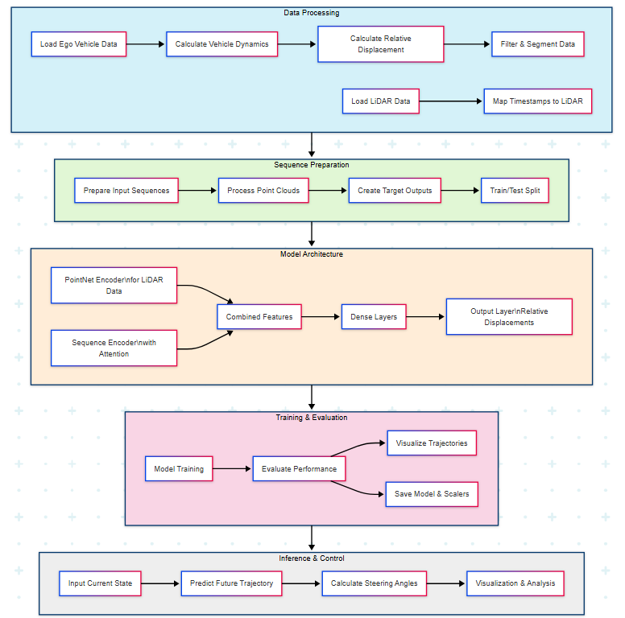

.. CARLA Trajectory Prediction overview

#############################################
Overview
#############################################

Introduction
===========

CARLA Trajectory Prediction is a machine learning framework for predicting vehicle trajectories
in the CARLA autonomous driving simulator. It provides a comprehensive solution for collecting
data, training predictive models, and evaluating their performance in complex urban environments.

The framework leverages time series/deep learning techniques to predict future vehicle positions based on
historical motion data and LiDAR point cloud information, enabling applications in autonomous
vehicle planning, traffic simulation, and safety analysis.

System Architecture
==================

The framework consists of four main components:

1. **Data Collection**: Utilities for gathering vehicle data and LiDAR point clouds from CARLA
2. **Data Processing**: Tools for preprocessing, segmentation, and feature extraction
3. **Model Training**: Deep learning models based on sequence encoding and point cloud processing
4. **Evaluation**: Metrics and visualization tools for assessing prediction accuracy

Key Concepts
===========

Relative Displacement Representation
-----------------------------------

Instead of predicting absolute positions, the framework uses relative displacements between
consecutive frames. This approach provides several advantages:

- More stable training dynamics
- Invariance to absolute positioning
- Better generalization across different scenarios
- Reduced prediction drift over long sequences

Point Cloud Processing
--------------------

LiDAR point clouds provide crucial context about the vehicle's surroundings. The framework
processes this data using:

- Point cloud sampling with distance-based weighting
- Normalization techniques for improved stability
- PointNet-inspired architecture for feature extraction
- Combined sequence and point cloud feature fusion

Trajectory Evaluation
-------------------

The framework evaluates predictions using multiple metrics:

- Mean displacement error (average across all time steps)
- Final displacement error (accuracy of final predicted position)
- Speed-based error analysis (performance at different speeds)
- Path smoothness metrics (assessing trajectory naturalness)

Use Cases
========

- **Autonomous Vehicle Planning**: Generate predicted trajectories for surrounding vehicles
- **Traffic Simulation**: Create realistic vehicle behaviors in simulated environments
- **Safety Analysis**: Evaluate potential collision scenarios
- **Driver Behavior Modeling**: Learn patterns from human driving data
- **Research & Development**: Benchmark and improve trajectory prediction algorithms

Technology Stack
==============

The framework is built using:

- **TensorFlow/Keras**: Deep learning model architecture and training
- **NumPy/Pandas**: Data processing and manipulation
- **scikit-learn**: Feature scaling and preprocessing
- **Matplotlib/Plotly**: Visualization and analysis tools
- **CARLA Simulator**: Data generation and simulation environment